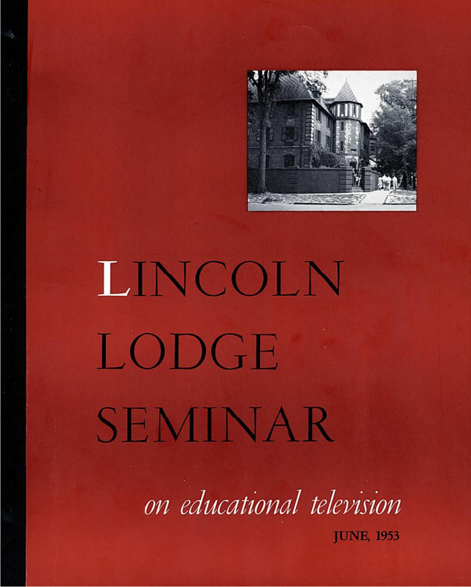

Public Broadcasting arose in the U.S. during the 1920s, a time of intense anxiety around the country’s educational and aesthetic preparedness on the world stage. In the music community this gave birth to a robust music appreciation movement focused on instilling the value of classical music in young minds. Public school music lessons and college survey courses increased during the period, but efforts extended beyond the classroom through the use of technology. Educator Frances Elliott Clark launched a phonograph campaign, declaring that, “If America is ever to become a great nation musically, as she has become commercially and politically, it must come through educating everybody to know and love good music” (Clark in Katzs). Both Clark and her audience understood “good” music to be classical music, as opposed to jazz or broadway.

Should the imagined Dick or Jane in Clark’s Music Appreciation class get the bug for classical music listening, the radio provided cheap and easy access to it. During the 1920s and 1930s network radio broadcast hours of live concerts. In 1927, CBS created an in-house orchestra led by Howard Barlow. A decade later NBC created an orchestra ensemble led by Arturo Toscanini. It became enormously popular with listeners and advertisers alike.

By the 1950s, both radio and classical music had migrated to the academy. Temporarily buoyed by post-war pent-up demand for education thanks to the G.I. Bill, and optimistic about the future thanks to the baby boom, higher education was in a period of unprecedented expansion. Music programs found that they could shelter composers writing experimental works in the ivory tower, which countered the vicissitudes of the musical marketplace. At the same time several large land-grant universities had radio stations which allowed them to share their educational resources with the larger community. As a result, there is a surprising amount of classical music presented and discussed in the collections assembled through *Broadcasting A/V Data*.

**Burton Paulu**

One advocate for classical music on public radio was Burton Paulu. He came to Minnesota to get a degree in music from the University of Minnesota in 1931. That year he got a job at KUOM, developing a music appreciation series that lasted fourteen years. He became station director of KUOM in 1938. During WWII, Paulu temporarily left KUOM to serve in the Office of War Information. He returned after the war with a new vision for what music over the airwaves could and should do, and he applied this to his work as a radio manager and an advocate for public radio. That work accelerated after he earned a Ph.D. in communications from New York University in 1949 with a specialization in the comparative study of U.S. and British public radio systems.

Two documents provide Paulu’s own account of the role of music in his career. The first is part of KUOM’s “Retrospective Spectacular,” a digitized recording of a series of interviews and old audio clips created in 1974 and currently held at the University of Minnesota.

In the March 30 episode, Paulu discusses the intricacies of his job as music director of KUOM:

> Retrospective Spectacular, Reel 8, March 30, 1974, uarc1124_tray167_20, tray: 167. University Archives. <https://umedia.lib.umn.edu/item/p16022coll171:1849>

The second is an oral history in the Burt Harrison Collection of Public Radio Oral Histories at the University of Maryland taken in 1978:

> Burt Harrison papers, Special Collections, University of Maryland Libraries. <http://hdl.handle.net/1903.1/1565>

Additional holdings at the University of Minnesota that are accessible through Broadcasting A/V Data reveal more about the details of Paulu’s musical expertise and advocacy. For example, among the holdings are scripts and programs from his first foray into radio, the music appreciation course for KUOM. It was very much in the model put forward by France Elliott Clark in her phonograph series. Such programs got an extra boost from the polio epidemic, which periodically required young students to isolate at home. 

> A Radio Course in Music Appreciation by Burton Paulu, September 1936 - June 10, 1937, Box: 55. University Archives. And: Music Appreciation. University Archives. <https://archives.lib.umn.edu/repositories/14/archival_objects/747277>

During the middle of the 20th century, as Paulu graduated into administrative roles at KUOM and NAEB, he became a strong advocate for the value of education on the radio. Digitized [correspondence on *Unlocking the Airwaves*](https://www.unlockingtheairwaves.org/people/Q5000894/) shows his name attached to numerous grant proposals and his work on behalf of the NAEB.  

He edited a volume summarizing the findings presented at the [“Lincoln Lodge Seminar" on Educational Television](https://www.unlockingtheairwaves.org/document/naeb-b105-f02-05/) in 1953. 

His developing expertise on international radio, particularly his study of the BBC through several Fulbright grants to travel to Britain and study their system is also apparent in [this documentation](https://www.unlockingtheairwaves.org/document/naeb-b070-f03/#161).

Through much of this period Paulu was a fill-in trombonist with the Minneapolis Symphony, staying engaged with music via performance. By the late 1960s, Paulu was using his connections within the music community to record and broadcast a series of oral histories. Interviewees included Henryk Szeryng, Jascha Horenstein, Morton Gould, Yehudi Menuhin, Stanislaw Skrowaczweski, and Eugene Ormandy.  All of these interviews are available from the University of Minnesota archives. See, for instance:

> Henryk Szeryng interviewed on his musical views by Burton Paulu on the Afternoon Concert Minnesota Orchestra Preview, March 26, 1970, uarc1125_tray053_522, Tray: 53. University Archives. <https://archives.lib.umn.edu/repositories/14/archival_objects/963443>

**Music on Public Radio**

The musical programs Paulu coordinated are just a small portion of public radio musical programming documented through Broadcasting A/V Data. Public radio stations provided a perfect medium for exploring music. The material in Broadcasting reflects that suitability, with over 55 music programs spanning the years documented. Laura Schnitker explores some of the Classical and Jazz programs affiliated with NAEB in her [exhibit for Unlocking the Airwaves](https://www.unlockingtheairwaves.org/exhibits/music-programs-in-the-naeb-collection/). 

As demonstrated in the Paulu materials cited above, the nature of educational music programs varied quite a bit. In some cases, programs were simply re-broadcasting concerts with a short introduction at the beginning. Other programs, however, were analytical in nature, perhaps catering to a K-12 music appreciation audience, lecturing in the style of a college classroom, or using music to tell current event stories in a more journalistic style. In all cases, educational radio provided listeners access to a wide variety of musical styles and approaches in a relatively frictionless and economical way.

**Selected Books and Documents by Burton Paulu:**

Burton, Paulu. British Broadcasting: Radio and Television in the United Kingdom. Minneapolis: University of Minnesota Press, 1956.

\_\_\_\__. British Broadcasting in Transition. Minneapolis: University of Minnesota Press, 1961.

\_\_\_\__. “Controversies in Mass News: The Red Lion Decision” in Mass News: Practices, Controversies, and Alternatives, edited by David J. LeRoy and Christopher H. Sterling. Englewood Cliffs, N.J., Prentice-Hall, 1973. 

\_\_\_\__. Radio and Television Broadcasting in Eastern Europe. Minneapolis: University of Minnesota Press, 1974.

\_\_\_\__. Radio and Television Broadcasting on the European Continent. Minneapolis: University of Minnesota Press, 1967.

\_\_\_\__. Television and Radio in the United Kingdom. Minneapolis: University of Minnesota Press, 1981.

Works Cited:

Katz, Mark. “Making America More Musical Through the Phonograph” American Music  vol. 
16, no. 4, University of Illinois Press, 1998, pp. 448–76, <https://doi.org/10.2307/3052289>