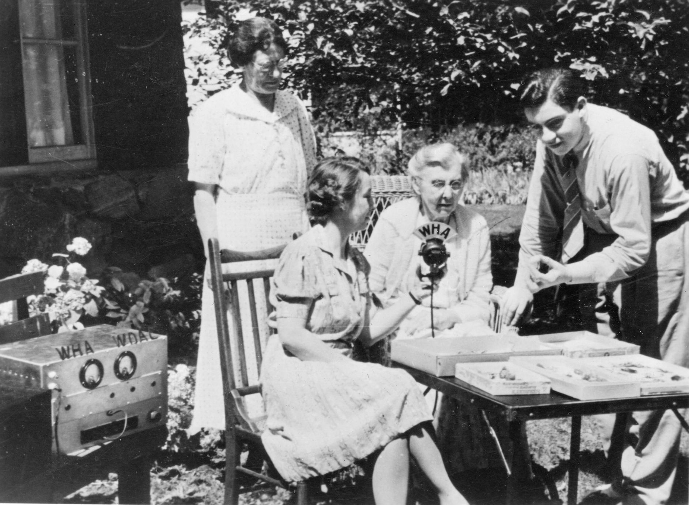
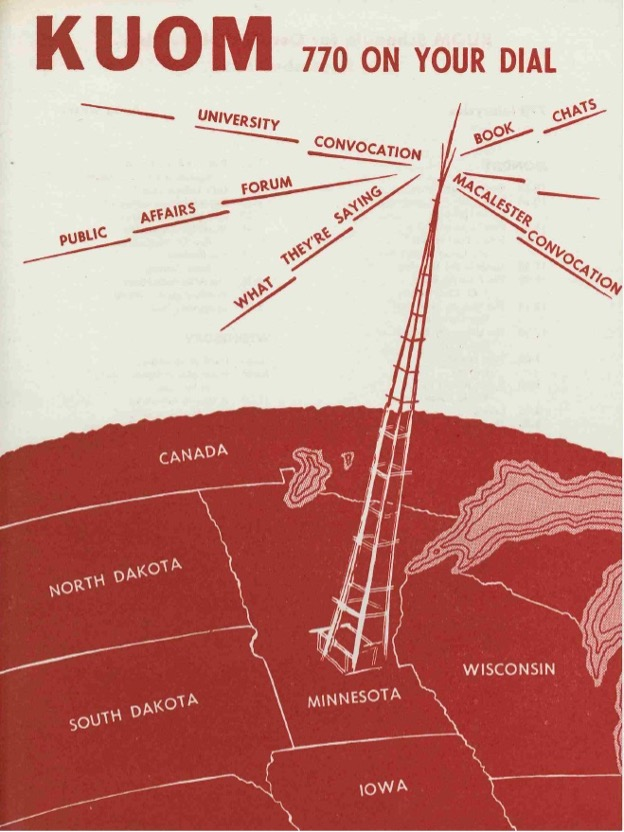

**Background**

One of the hardest lessons to learn when conducting historical research is that the artifacts you find are only a part of the story you need to tell. We learn critical information from exploring the alleyways, the side streets, and the dead ends of archival research and probing the gaps in the historical record. When assembling a narrative, we must look at objects both lost and found, erased and recovered, to assemble a more truthful account of the past. This methodological perspective is particularly important when studying the historical relationship between marginalized groups and the media. Whether in women’s history or in sound studies, preserving audio, especially the voices of housewives, has rarely been prioritized. To tell the story of women’s lives in twentieth-century America as told on radio, for example, history can’t be written only from what is found, but by stringing together pieces of audio and archived documents that together tell a more complete story. The Broadcast A/V project offers opportunities across four non-commercial media collections to piece together how rural women were imagined and addressed by educational radio throughout the twentieth century.

The tales told to and about Midwestern farm women were greatly influenced by the emergence of radio in the 1910s and 1920s. Colleges and universities, particularly land-grant agricultural institutions like the University of Wisconsin, drove much early radio experimentation. The agricultural extension tradition of these schools, their mission to educate farm families about modern agricultural practices and to improve rural life, influenced how American radio was expected to serve the public. Although early radio had been the province of mostly male technical enthusiasts who bought parts and built their own sets, radio was brought “out of the attic and into the living room” when RCA, one of the largest radio manufacturers, began selling pre-assembled radio sets to homes in 1922 (Boddy). This marketing push dramatically expanded the radio audience, with sales of sets increasing from 60,000 to 1.5 million between 1922 and 1923 (Ruben). Amid this radio boom, female homemakers displaced male hobbyists as the main audience for radio and radio was redefined as a “domestic technology” (Boddy).

Radio’s need to appeal to women created opportunities for women, as on-air talent or as at-home listeners, to claim parts of the daytime airwaves to talk about their lives and interests. One of the earliest forms of daytime radio programming were homemaking programs. These programs, which spoke about cooking, sewing, cleaning, parenting, and/or gardening to a predominantly female listening audience, originated on local commercial and non-commercial radio stations in the early-to-mid-1920s. These programs were prominent briefly in the late 1920s on national networks, but were quickly marginalized by the popularity of radio soap operas. For non-commercial or educational stations in the Midwest, however, homemaking programs anchored daytime schedules, remaining popular on university stations like WHA (University of Wisconsin), KUOM (University of Minnesota), and WOI (Iowa State University). As suggested by historian Erika Janik, “the region’s predominately rural population – in a nation become increasingly urban – gave the regional radio homemaker program particular resonance and importance to women living on isolated farms” (Janik). These programs drew farm wives to their radios and gathered them as an audience for the agricultural extension work so important to land-grant universities. While these programs often featured friendly hosts doling out recipes and helpful advice, the intent of these programs, argued Janik, was to change the role rural women played on family farms. As a way of “modernizing” the homemaking practices of farm wives, the aim of university extension work was “to turn rural women from farm producers into full-time homemakers and consumers” (Janik).

**WHA’s *Homemaker’s Program* (1929-1965)**

In 1922, the University of Wisconsin’s experimental radio station 9XM became one of the first stations to receive a radio license. Renamed WHA, the station became a pioneer in programming and practices in early radio. One of its most enduring contributions was its regional homemaking show, WHA’s *Homemaker’s Program*, which ran from 1929 until 1965. From its earliest days, WHA had featured female speakers from the Home Economics and Agricultural Journalism departments occasionally on its noontime *Farm Hour*. In 1929, WHA program director Louis Mallory assembled various homemaking segments into a distinct, half-hour program aimed at Wisconsin homemakers. When host Aline Hazard (1895-1981) took over the helm in June 1933, the show found its stride. Six days a week, for thirty-two years, and over ten thousand episodes, Hazard greeted wives across the Midwest with a cheery “Good Morning Homemakers!” The digital archives of WHA offer dozens of examples of the scope of this groundbreaking program. In addition to homemaking, Hazard incorporated art and music appreciation segments, crafts, speakers, remote broadcasts, and a weekly book club into the program. 

An example of the extension work critical to the ethos of the *Homemaker’s Program* is 
a July 31, 1945 interview with Mae Reynolds from UW’s Home Economics department on the proper method to can peaches and pears: \[<https://search.library.wisc.edu/digital/AFJUUS4K5S5WKB9B>]

The *Homemaker’s Program* also educated listeners on important state products. A segment titled “Cheese: A Food History” from November 23, 1945 in which Hazard interviews Roy Ricksham, the manager of the American Dairy Association of Wisconsin, is typical of this kind of approach. \[<https://search.library.wisc.edu/digital/AXPOMHEIW7XPR58Y>]

Described by former Wisconsin Public Radio director Jack Mitchell as “a cross between today’s Martha Stewart and Oprah Winfrey,” Hazard defined Wisconsin homemaking for more than three decades (Mitchell). Until its end in 1965, the *Homemaker’s Program* remained one of the most popular programs on WHA. In 2016, Aline Hazard was inducted into the Wisconsin Broadcasters Hall of Fame in celebration of her service to Wisconsin women.

**Shift in Perspective: From Radio Homemaking to Women’s Public Affairs** 

In the 1960s and 1970s, the burgeoning feminist movement and the birth of National Public Radio (NPR) began to change the way educational broadcasters spoke to rural women. The friendly radio voices that had once instructed farm wives on modern home management were out of tune with the politics of the later postwar era. As described in Betty Friedan’s *The Feminine Mystique* (1963), a new generation had come of age who questioned the gender ideals and homemaking practices of previous generations. Indeed, not long after Hazard’s retirement in 1965, the *Homemaker’s Program* was re-branded as a lifestyle and social issue program named *Accent on Living* (1966-1978) to broaden the show’s appeal beyond homemakers. By 1978, WHA’s *Farm Hour* and *Accent on Living* combined to create WHA’s first daily call-in public affairs program, *Wisconsin Hear and Now*. Similarly, other university broadcasting stations strayed from their focus on homemaking to discuss the political and social issues facing contemporary women. 

Educational stations struggled on both radio and TV to adjust their address to the female audience. For example, a 1968 report from the National Council of Educational Radio and Educational Television in the NAEB collection discusses Auburn University’s experimental TV program *Katie’s House* which reveals the difficulties reconceptualizing programming for rural homemakers amid the social and political upheaval of the time.

**KUOM’s Equal Voice: A Woman’s Forum (1976-1984)**

Minnesota’s KUOM was granted a broadcast license on the same day as WHA in 1922. For most of its life, WLB/KUOM operated in the daytime under the auspices of the University of Minnesota. The station focused on education, community interests, and public affairs. 

As part of an intentional effort between 1969 and 1984 to reach marginalized communities, KUOM scheduled programs like *On The Black Side*, *Echoes en Español*, *Indian News*, and *Equal Voice*. On February 5, 1976, KUOM producer and Women’s Program Director Carol Robertshaw debuted the women’s public affairs program, *Equal Voice: A Woman’s Forum*. This series, a weekly part of the *Public Affairs Hour*, was broadcast on Thursdays from 1:30 to 2 p.m. Replacing the previous female-centered newscast, *Women’s Clearinghouse*, *Equal Voice* offered female listeners discussions of current events and one-on-one interviews with female academics, activists, and politicians. Over the course of eight years, Robertshaw shepherded listeners through a wide array of topics meaningful to women in the 1970s and 1980s: the cost of childcare, debates about the Equal Rights Amendment, the prevalence of domestic violence, and the needs of racially and economically diverse groups of women.

The tone of the series was set by the first stanza of the song “Custom Made Woman Blues” played as the opening and closing to this series. This song, a cut from the 1973 album *Hazel & Alice,* the first bluegrass album recorded by women, was written and performed by Alice Gerrard (1934-) and Hazel Dickens (1935-2011). Set against the sound of a lonely country fiddle, Dickens rues the lies she has been told about how to be a woman and how to keep a man. She wails:

> Well, I tried to be the kind of woman you wanted me to be
> And it’s not your fault that I tried to be what I thought you wanted to see
> Smiling face, shining hair, clothes that I thought you’d like me to wear
> Made to please and not to tease, it’s the custom made woman blues

**Audio Excerpt** of Custom Made Woman Blues (1973): <https://youtu.be/T61RV8tp2y8>

It is difficult to not read the use of this blues song as a commentary on the efforts of educational stations to mold rural listeners into ideal homemakers.

To date, nearly three hundred episodes of *Equal Voice* are accessible through the Broadcasting A/V Data project. Much of this audio depicts women wrestling with and sometimes chafing at the restrictions of traditional ideals of femininity. In an episode titled “Rural Women and The Women’s Movement,” Robertshaw interviews Beverly Everett, an Iowa farm woman and rural representative to the Executive Committee appointee on the National Commission of the Observance of International Women’s Year. While Everett details the fraught relationship between farm women and the women’s movement, this episode’s discussion of legal obstacles farm women face inheriting land and arguments for women’s crucial role in agribusiness addresses rural listeners as equal business partners in the family farm. 

**Audio:** Rural Women and the Women’s Movement with Beverly Everett, of 1970s: <https://umedia.lib.umn.edu/item/p16022coll171:2718>

Whether in interviews with national figures like Betty Friedan or Gloria Steinem or during discussions of local rural life, the University of Minnesota’s audio collection of *Equal Voice* offers insight into women’s struggle to see and hear themselves represented in media. A 1977 interview with a young Ruth Ginsburg, for example, offers rural listeners an analysis of the fight for women’s civil liberties in the U.S. Supreme Court.

**Audio:** Civil Liberties, Women, and the Supreme Court with Ruth Ginsburg <https://umedia.lib.umn.edu/item/p16022coll171:2778?facets%5Bsubject_ss%5D%5B%5D=Equal+Voice&page=2>

From the warm greeting of Aline Hazard’s “Good morning homemakers” during the depths of the Great Depression to the wail of Hazel Dickens’ “Custom Made Woman Blues” recorded as the women’s movement gained steam, these programs from various times and various archives trace the evolution of non-commercial radio programming for women. If you listen carefully through these various collections, I argue, you can hear the tentative and sometimes radical shifts in address to the female radio listener and the changes in women’s lives over the course of the twentieth century. 

**Recommended Reading:**

Boddy, William. *New Media and Popular Imagination – Launching Radio, Television, and Digital Media in the United States*. New York: Oxford University Press, 2004.

Janik, Erika. “Good Morning Homemakers!” *Wisconsin Magazine of History* 90.1 (Autumn 2006): pp.4-15.

Mitchell, Jack. Wisconsin on the Air – *100 Years of Public Broadcasting in the State That Invented It*. Madison, WI: Wisconsin Historical Society Press, 2016.

Ruben, Marina Koestler. “Radio Activity – The 100th Anniversary of Public Broadcasting.” *Smithsonian Magazine* (January 26, 2010):  <https://www.smithsonianmag.com/history/radio-activity-the-100th-anniversary-of-public-broadcasting-6555594/>.

\*\**

**Jennifer Hyland Wang** is a broadcast historian who adjuncts at the University of Wisconsin-Madison where she finished her Ph.D. Her dissertation, “Convenient Fictions: The Construction of the Daytime Radio Audience, 1927-1960,” traces the history of the construction of daytime programming on radio and television through a careful examination of the creation and circulation of the concept of a "daytime female audience" within the broadcast industry and American culture. Her current research largely focuses on the relationship between gender and broadcast media, specifically on radio, daytime programming, podcasting, and women's labor. Her published work can be found in the *Radio Reader*, the *Cinema Journal*, *The Journal of e-Media Studies*, *Feminist Media Histories*, the *New Review of Film and Television Studies*, and the *Journal of Radio and Audio Media*. Her work on radio and podcasting will be featured in the forthcoming edited collections, *Saving New Sounds: Dispatches from the PodcastRE Project*, *The Routledge Companion to Radio Studies*, and *The Oxford Handbook of Radio Studies*.